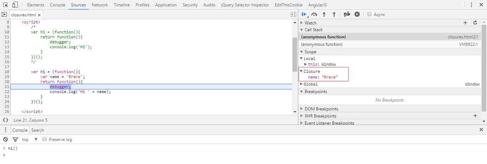
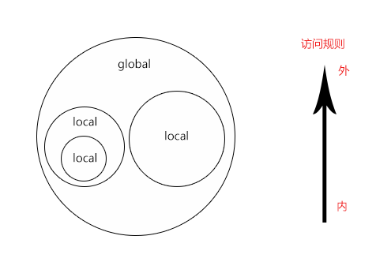

## 什么是闭包？
多么犀利的一个问题呀，不知秒杀了多少FEers。对于这个问题的回答是仁者见仁智者见智，这主要取决于每个人的知识层面。下面列举了一些比较权威的解答：

> [维基百科](https://zh.wikipedia.org/wiki/%E9%97%AD%E5%8C%85_(%E8%AE%A1%E7%AE%97%E6%9C%BA%E7%A7%91%E5%AD%A6)): 在计算机科学中，闭包（Closure），又称词法闭包（Lexical Closure）或函数闭包（function closures），是引用了自由变量的函数。这个被引用的自由变量将和这个函数一同存在，即使已经离开了创造它的环境也不例外。所以，有另一种说法认为闭包是由函数和与其相关的引用环境组合而成的实体。闭包在运行时可以有多个实例，不同的引用环境和相同的函数组合可以产生不同的实例。
在一些语言中，在函数中可以（嵌套）定义另一个函数时，如果内部的函数引用了外部的函数的变量，则可能产生闭包。运行时，一旦外部的函数被执行，一个闭包就形成了，闭包中包含了内部函数的代码，以及所需外部函数中的变量的引用。其中所引用的变量称作上值(upvalue)。

> [MDN](https://developer.mozilla.org/en-US/docs/Web/JavaScript/Closures): Closures are functions that refer to independent (free) variables (variables that are used locally, but defined in an enclosing scope). In other words, these functions 'remember' the environment in which they were created. 

> 《JavaScript Niaja（忍者秘籍）- John Resig》: A closure is a way to access and manipulate external variables from within a function. Another way of imagining it is the fact that a function is able to access all the variables, and functions, declared in the same scope as itself. 


> 《Professional JavaScript for Web Developers （JavaScript高级程序设计）- Nicholas C.Zakas》: Closures are functions that have access to variables from another function ’ s scope. This is often accomplished by creating a function inside a function。


通过维基百科、MDN和一些大牛对闭包的描述可以看出，把闭包定义为一种特殊的函数是业界的一种主流的认识；但是个人更倾向于维基百科的第二种定义：闭包是函数和其相关的引用环境组合而成的实体。为了便于描述和少数服从多数的原则并结合以上描述给出一个我对闭包的定义。**闭包：可以引用和操作父函数作用域内的变量并且在父函数调用完成后依然有效的一种特殊（子）函数。**

## 怎么创建闭包？
根据定义可知闭包是一个父函数嵌套子函数的形式且为了能够引用到子函数须返回该函数，与此同时子函数必须的引用父函数作用域内的变量或者其他函数，并且在父函数调用完成后依然有效。

Demo:

```js
var hi = (function(){
  var name = 'Brave';
  return function(){
    console.log('Hi ' + name);
  }
})();

hi();
```
在子函数的内部打个断点查看一下闭包的执行情况，注意一下红色框框圈起来的内容。

Chrome浏览器中可以很清楚的看到在闭包调用时创建了一个名为Closure的的作用域对象（暂时就这么形容这个Closure），该对象包含了闭包所有引用的自由变量（即脱离了父函数作用域的变量）。当然如果子函数没有引用父函数作用域内的变量也就不会创建这个对象。其实也可以这么认为如果一个函数调用的时候创建了这个名为Closure的作用域对象那么这个函数就是闭包。

## 闭包是如何实现的？（猜想）
在诸多的函数式编程语言中都有闭包功能的实现，具体的实现上也各有千秋。我尝试从作用域（Scope）、内存管理（GC）的角度来描述下闭包，首先明确下作用域和内存管理的相关概念。

### 作用域（Scope）
我们在讨论作用域的时候是一直围绕着变量在进行的，如果脱离了变量讨论作用域就没有意义了。作用域的字面理解就是变量的影响范围，其实也是变量的查找规则。
在编程语言中作用域分为：全局作用域、局部作用域、块级作用域。在JavaScript中全局作用域一般指window对象或global对象（主要和平台相关），局部作用域是指函数作用域，块级作用域就是两个花括号之间的范围，他们主要区别是其作用域内的变量影响范围和生命周期。


可以把作用域想象成上图，一个大圆里套着若干个小圆，小圆里还可以接着套小圆。小圆们都在大圆里，小圆和小圆之间存在着嵌套和隔离的关系。在这里大圆相当于全局作用域，小圆相当于局部作用域。作用域的访问规则是由内到外层层访问。局部作用域（小圆）能访问父级以及全局作用域（大圆）内的变量，但隔离的局部作用域内的变量是不能相互访问的。全局变量全局可见，其生命周期一直到程序执行完毕；局部变量仅局部可见，其生命周期一般是函数调用的周期。

### 内存管理（GC）
因为内存是有限的，同时我们的计算机上要运行很多的程序，所以我们的程序不能一直只使用内存而不去释放内存。由此所有的编程语言都引入了内存管理机制去控制对内存的使用。大致规则是这样的：分配你所需要的内存，使用分配到的内存，不需要时将其释放。

### 接下来看一下在纯函数和闭包中作用域（Scope）、内存管理（GC）是怎样工作的。

Demo: 纯函数（相对闭包）
```js
function sum(x, y) {
  var total = x + y;
  return total;
}

sum(1, 1);
```
这是一个两个数求和的函数，在函数内部声明total变量；根据作用域访问规则，在函数的外部是无法访问到这个变量的，该变量只在函数内部可见。在该函数调用的时候会为total变量申请内存空间来存储它的值，当调用结束后total变量申请的内存空间就会被释放。这就是内存管理机制帮我们做的。

Demo: 闭包
```js
var hi = (function a(){                // 父函数
  var name = 'Brave';
  return function b(){               // 子函数
    console.log('Hi ' + name);
  }
})();

hi();
```
在父函数a的作用域内部声明name变量和子函数b，然后返回子函数b且子函数b引用了父函数a作用域内的变量，按照上面的定义这就是一个闭包。这个例子唯一特殊的是父函数a是个立即执行函数（这并不影响闭包的创建），执行结果赋值给了全局变量hi,变量hi就变身成了一个闭包。按照上面提到作用域访问规则去分析，hi闭包现在处在全局的作用域内，它只能访问全局作用域内的变量，又因为全局作用域内不存在变量name，所以输出结果是`Hi undefined`。但结果是出人意料的，输出的结果是`Hi Brave`。这就是闭包的特性，它突破了作用域和内存管理的一些限制。或者可以这么说，为了实现闭包的这个特性编程语言在作用域和内存管理方面做了某些调整。

闭包能绑定它引用的变量或函数，并将其保存在一个特殊的数据结构中，这个数据结构就像全局变量一样一直存在，直到程序执行结束。 

## 闭包有什么用途？
据作用域的访问规则，可知局部变量只能在局部作用域内使用，全局作用域和隔离的局部作用域是不能访问的。然而通过闭包就可以间接的访问到局部作用域内的变量，弥补了JavaScript不具有私有变量的不足。

Demo:
```js
function Person(name, age) {
  this.name = name;
  this.age = age;

  this.setName = function(name) {
    if ( 'string' === typeof name ) {
      this.name = name;
    } else {
      console.error('typeError!');
    }
  }

  this.setAge = function(age) {
    if ( 'number' === typeof age ) {
      this.age = age;
    } else {
      console.error('typeError!');
    }
  }

}

var p1 = new Person('Brave', 18);
console.log(p1.name);  // Brave
p1.setName(10);  // typeError
p1.name = 10;
console.log(p1.name);  // 10
```
上面的代码创建了一个名为Person的构造函数，然后实例化一个对象p1，p1.name的初始值是`Brave`；通过p1.setName方法重新给name赋值为 10，不过因为有条件控制，所以就会输出`typeError`，这是我们期望的运行方式；但是无法阻止这样的赋值方式`p1.name ＝ 10`，这并不是我们想要的结果。怎么可以避免这种情况发生呢，那就是使用闭包，只提供一种修改值的方法。

Demo:
```js
function Person(name, age) {
  var name = name;
  var age = age;

  this.getName = function() {
    return name;
  }

  this.setName = function(name) {
    if ( 'string' === typeof name ) {
      name = name;
    } else {
      console.error('typeError!');
    }
  }

  this.getAge = function() {
    return age;
  }

  this.setAge = function(age) {
    if ( 'number' === typeof name ) {
      age = age;
    } else {
      console.error('typeError!');
    }
  }

}

var p1 = new Person('Brave', 18);
p1.getName();  // Brave
p1.setName(10);  // typeError
```
这样就保证对p1对象name属性的绝对控制。但同时对name属性引用方式也发生了改变，好像不如以前方便了。其实还有别的方式可以在这里就不赘述了。 
以上只是闭包应用的一种场景，其他的应用方式也不外乎如此，主要还是利用闭包能够‘记忆’它的引用环境从而加以运用。  

## 总结
其实只要能够用自己的语言描述出闭包的特性，灵活运用就好。面试官问这个问题多数出于考察你会从什么角度去解释这个问题，从而确定你处于一个什么样的层次。
